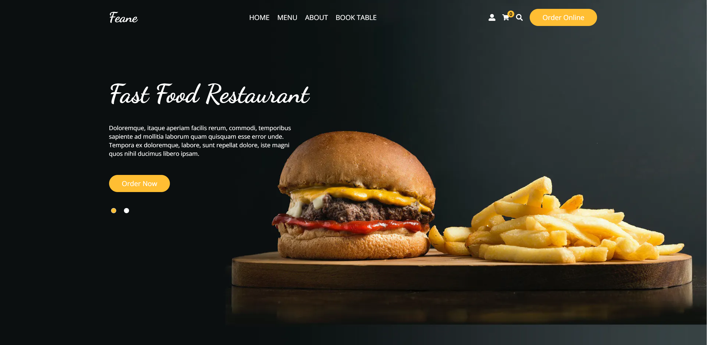
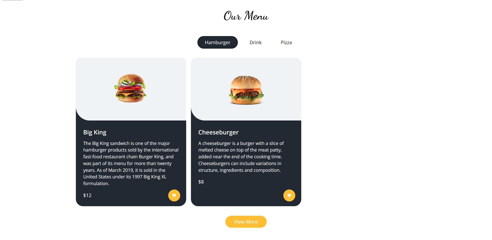
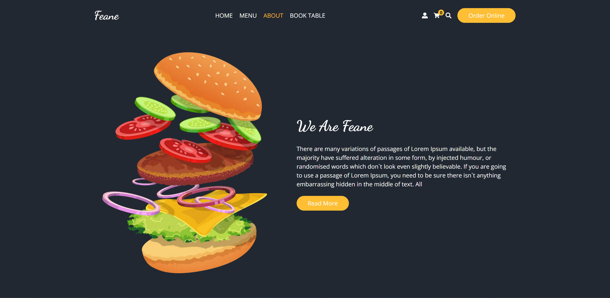
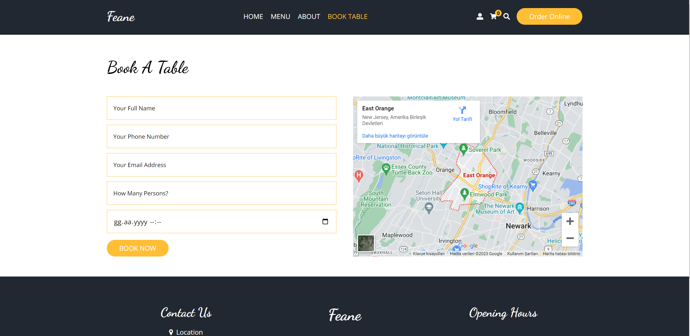
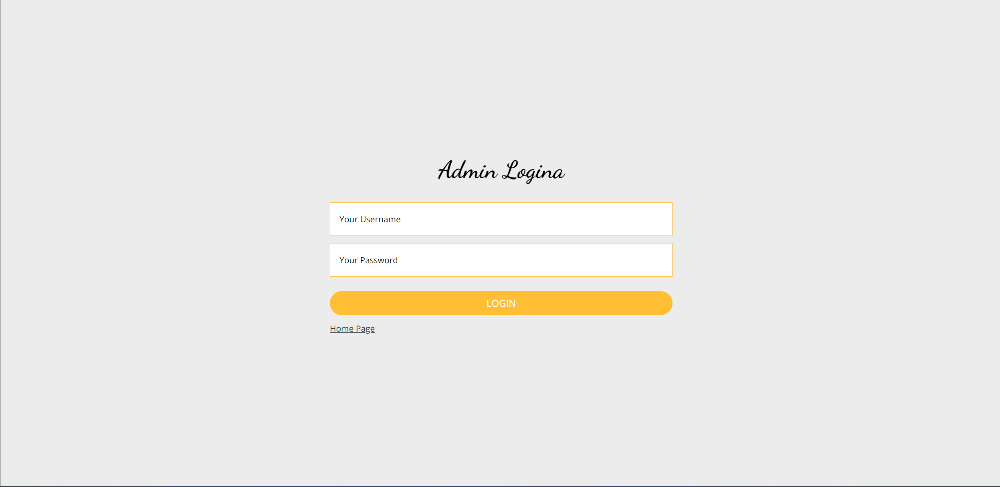
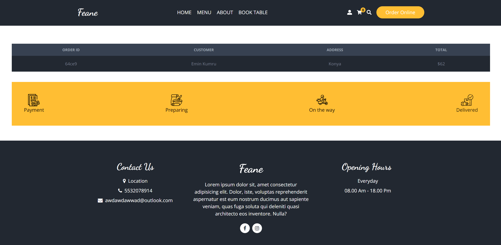

This is a [Next.js](https://nextjs.org/) project bootstrapped with [`create-next-app`](https://github.com/vercel/next.js/tree/canary/packages/create-next-app).

# Food Ordering Project

Hello,

I worked on the Food Ordering Project, which is a comprehensive web application developed using various technologies.

## Project Content and Features

- Developed with the concept of Single Page Application.
- Created the Front-End infrastructure using React and Next.js technologies.
- Implemented responsive transitions with Tailwind CSS.
- Optimized state management using Redux-Toolkit.
- Simplified user authentication using Next-Auth.
- Handled form controls and data validation with Formik and Yup.
- Utilized MongoDB for database operations.
- Added an Admin Management Panel and implemented user profiles.

## Extra Features Developed by Me

In addition to the core features taught by the course instructors, I added some extra features to enrich the project:

- Enhanced state management with Redux-Toolkit to optimize data flow between different components.
- Implemented a user-friendly error handling mechanism to provide better guidance in case of possible errors.
- Improved database queries for more efficient data processing with MongoDB.
- Implemented the "Order Customization" feature, allowing users to personalize their orders.

## How to Use?

1. Clone the project: `git clone https://github.com/your_username/food-ordering-project.git`
2. Install the necessary dependencies: `npm install`
3. Start the project: `npm run dev`
4. View the project in your browser at `http://localhost:3000`.

## Project Screenshot

## Acknowledgments

To explore the project and learn more, visit the GitHub page: [GitHub Project Page](https://github.com/your_username/food-ordering-project)

Best regards,
Catruc Andrei
